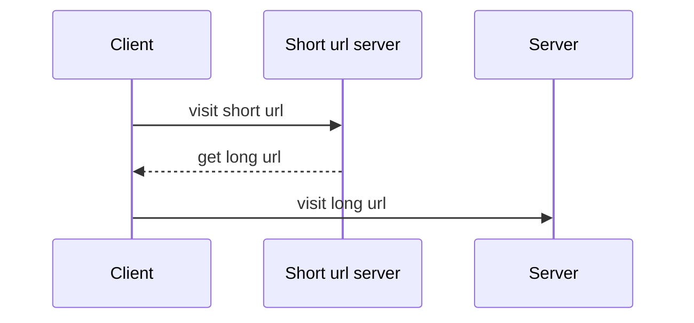
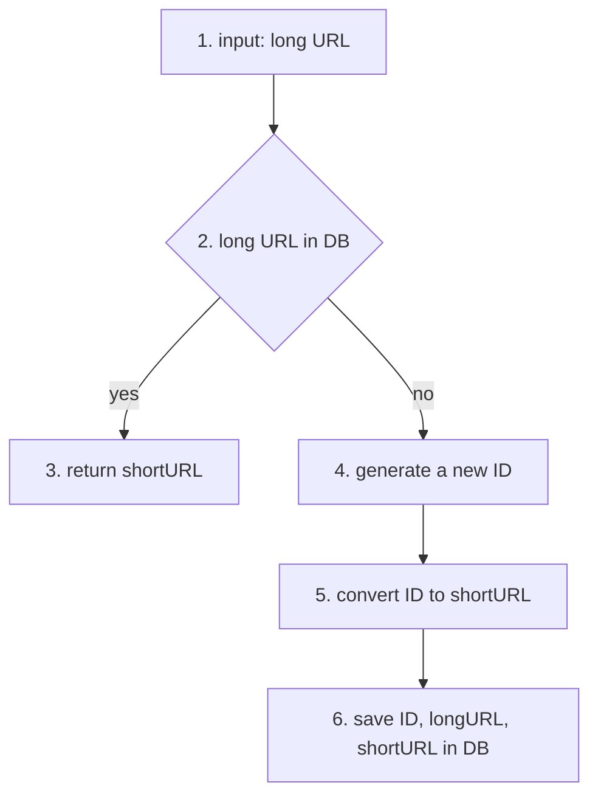
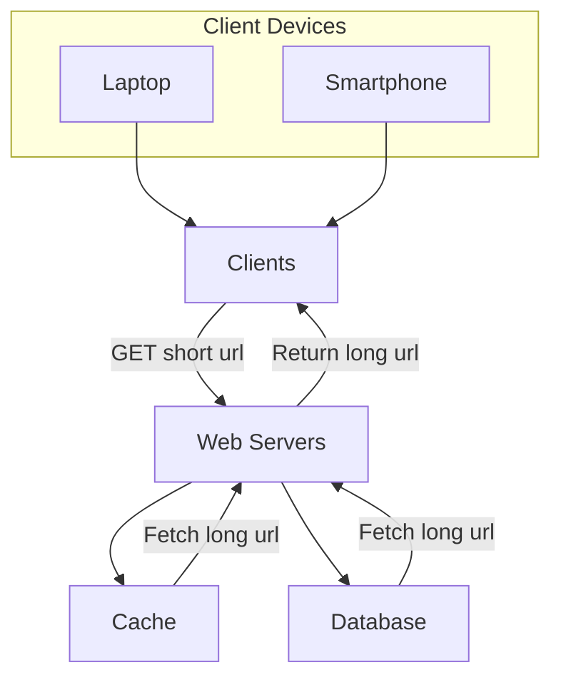

<h1 align="center"> URL Shortener </h1> <br>

<h3 align="center">
  A URL Shortener app to short long URL. Built with Python/Django Rest Framework.
</h3>

## Table of Contents

- [Introduction](#introduction)
- [Features](#features)
- [API Endpoints](#api-endpoints)
- [Snowflake ID Generator](#snowflake-id-generator)
- [Base 62 conversion](#base-62-conversion)
- [URL Shortening](#url-shortening)
- [URL Redirecting](#url-redirecting)
- [Project Setup](#project-setup)
- [Contributing](#contributing)
- [License](#license)

## Introduction

A URL Shortener is a tool designed to transform long, cumbersome URLs into shorter, more manageable links. This project provides a simple and efficient way for users to create concise URLs that are easier to share, remember, and manage. Whether you're sharing links via social media, emails, or printed materials, this URL shortener ensures your links are user-friendly and aesthetically pleasing. Additionally, it can help track link usage and analytics, offering insights into user engagement and click-through rates.

## Features

A few of futher on this app:

- Separating the business logic layer
- Separation of test and production environments
- Customized user authentication
- Authorization for endpoints
- Use Redis cache
- Unit test for all app
- Github workflow
- Document project with swagger
- Dockerized project

## API Endpoints 
API endpoints facilitate the communication between clients and servers. We will design the APIs REST-style. A URL shortener primary needs two API endpoints. 

1. URL shortening. To create a new short URL, a client sends a POST request, which contains one parameter: `the original long URL`. The API looks like this:

`POST api/shortener/create`

    • request parameter: {longUrl: longURLString} 
    • return shortURL 

2. URL redirecting. To redirect a short URL to the corresponding long URL, a client sends a GET request which contains one parameter: `the short URL`. The API looks like this:

`GET api/shortener/{short_url}`

    • Return longURL for HTTP redirection

The detailed communication between clients and servers is shown in bottom diagram.



## Snowflake ID Generator

Twitter’s unique ID generation system called “snowflake”. Divide and conquer is our friend. Instead of generating an ID directly, we divide an ID into different sections.

• Sign bit: 1 bit. It will always be 0. This is reserved for future uses. It can potentially be used to distinguish between signed and unsigned numbers.

• Timestamp: 41 bits. Milliseconds since the epoch or custom epoch. We use Twitter snowflake default epoch 1288834974657, equivalent to Nov 04, 2010, 01:42:54 UTC.

• Datacenter ID: 5 bits, which gives us 2 ^ 5 = 32 datacenters.

• Machine ID: 5 bits, which gives us 2 ^ 5 = 32 machines per datacenter.

• Sequence number: 12 bits. For every ID generated on that machine/process, the sequence number is incremented by 1. The number is reset to 0 every millisecond.


## Base 62 conversion

Base 62 conversion Base conversion is another approach commonly used for URL shorteners. Base conversion helps to convert the same number between its different number representation systems. Base 62 conversion is used as there are 62 possible characters for hashValue. Let us use an example to explain how the conversion works: convert 11157 to base 62 representation (11157 represents 11157 in a base 10 system).

• From its name, base 62 is a way of using 62 characters for encoding. The mappings are: 0-0, ..., 9-9, 10-a, 11-b, ..., 35-z, 36-A, ..., 61-Z, where ‘a’ stands for 10, ‘Z’ stands for 61, etc.

• 11157 = 2 x 622 + 55 x 621 + 59 x 620 = [2, 55, 59] -> [2, T, X] in base 62

## URL Shortening

As one of the core pieces of the system, we want the URL shortening flow to be logically simple and functional. Base 62 conversion is used in our design. We build the following diagram to demonstrate the flow.



1. longURL is the input.
2. The system checks if the longURL is in the database.
3. If it is, it means the longURL was converted to shortURL before. In this case, fetch the shortURL from the database and return it to the client.
4. If not, the longURL is new. A new unique ID Is generated by the unique ID generator.
5. Convert the ID to shortURL with base 62 conversion.
6. Create a new database row with the ID, shortURL, and longURL.
To make the flow easier to understand, let us look at a concrete example.

    • Assuming the input longURL is: `https://en.wikipedia.org/wiki/Systems_design`

    • Unique ID generator returns ID: 2009215674938.

    • Convert the ID to shortURL using the base 62 conversion. ID (2009215674938) is converted to “zn9edcu”.
    • Save ID, shortURL, and longURL to the database.

## URL Redirecting

Bottom graph shows the detailed design of the URL redirecting. As there are more reads than writes, <shortURL, longURL> mapping is stored in a cache to improve performance.



## Project Setup

1. compelete cookiecutter workflow (recommendation: leave project_slug empty) and go inside the project
```
cd UrlShortener
```

2. Setup venv
```
python3 -m venv venv
source venv/bin/activate
```

3. install Dependencies
```
pip install -r requirements.txt
```

4. create your env
```
cp .env.example .env
```

5. spin off docker compose
```
docker compose -f docker-compose.dev.yml up -d
```

6. create tables
```
python manage.py migrate
```

7. run the project
```
python manage.py runserver
```

8. run tests
```
pyttest
```

## Contributing

Contributions are welcome! Please fork this repository, make your changes, and submit a pull request. For major changes, please open an issue first to discuss what you would like to change.

## License
This project is licensed under the MIT License. See the LICENSE file for more details.
